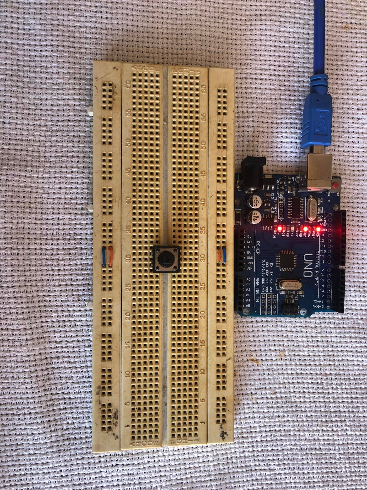
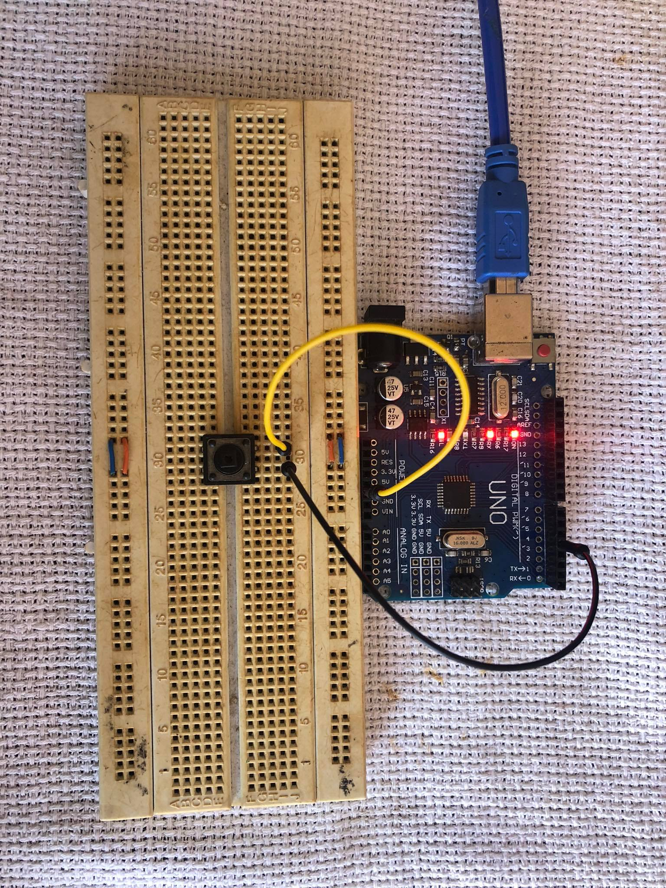
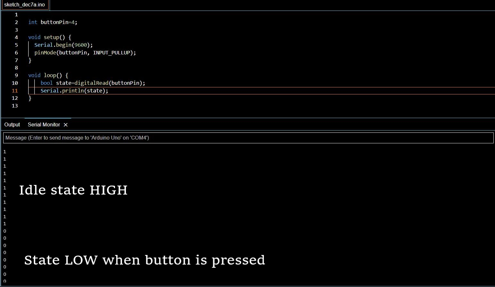

#  1. LED with push buttons

Now you would assume that buttons are simple entities, well they arent. If you try and apply buttons as a switch in real time it works just fine. However the moment you decide to sense the state of a push button and program an output with respect to it, you will fall into a pithole of getting weird values. 

In an ideal case a switch would have two states, on or off
|Input|State|
|:----|:----|
|0|LOW|
|1|HIIGH|

If you read the values you get from a push button pin you are expected to get one of **THREE** states, assuming that on the push buttons one pin is connected to GND pin of arduino, when the button is not being pressed you expect to read HIGH or 1(default state), when the button is pressed and the switch is closed you expect to read LOW or 0. 
|Input|State|
|:----|:----|
|0|LOW|
|1|HIIGH|
|idle|High impedence|

But you never consider that the arduino pin reading the value is also sensitive to external noise from other pins or electronic compoenents. This creates a weird grey area where the input pin neither reads 0 or 1 and keeps toggling betweeen the two values at very high speeds. This state is known as high impedance and the pin acts very similar to an antenna. 

Okay well, now we can see the issue as the idle state is not stable. How do we fix it? **pull up** or **pull down** resistors!!

## 1.1 Pull up/ pull down resistors
To solve the above issue, you need to pull the pin from which you read to your idle state(example: when the button is not pressed in our case we assume a value of 1 should be printed and when we press the button our new state is 1). Therefore in our case we pull up our read pin so that when buttton is not pressed the state shows 1. You can do this by connecting an actual resistor or you can use the **INPUT_PULLUP** function while defining pinmode which is a default function in arduino.

_Note: you donot have a **PULL_DOWN** function in arduino so if your default state is 0 or LOW you will need to use physical resistor to pull your pin down_.

The output after using the pull up method is shown below.

So that solves the issue of a unsteady idle state, same can be done for a 5V input on the button however the read pin will have to be pulled down for the given input on buttton.

[Code_for_reference](https://github.com/Darshansgit/EverythingArduino/blob/main/Arduino_basics/Code/1__InputPullup.ino)

## 1.2 Bouncing

Mechanical switches come with their own niche set of issues, when they change state from on to off they clatter where a single button press is registered multiple times. This phenomena is very annoying and makes it difficult for us to use push buttons in project. For instance, the following code is meant to keep a count of number of button pressses and it is supposed to light up the led when the number of button presses are equal to 5, the LED however seems to light up before the number of button presses are 5 often. 

https://user-images.githubusercontent.com/119427592/206106830-958c5dad-d75c-46e8-a5a3-c3bcea252af8.mp4

https://user-images.githubusercontent.com/119427592/206106866-df469a24-285f-4c43-a067-d96d0bd4ca36.mp4

In both the above cases the LED lights up before the buttton is pressed 5 times. We understand that the button is clattering when we lift our hands off the switch as thats when multiple pressses are registered.Therefore, a seperate function is created where when the button press is registered, the program waits for 10ms before declaring the button as pressed and proceeding to the next part of the control flow. The code snippet and the outcome is shown below. 

https://user-images.githubusercontent.com/119427592/206110236-9e3b1912-f6ca-4e03-aa53-776bf244f5a4.mp4

[Code_for_reference](https://github.com/Darshansgit/EverythingArduino/blob/main/Arduino_basics/Code/2_debouncing.ino)
